# How to use Git

당장 구글에 깃 사용법을 검색해서 나오는 여러 블로그들만 보더라도 깃이란 무엇이고 어떻게 사용하는지 알 수 있지만 여러 내용들을 복합적으로 가져와서 정리해봤습니다.

**_written by 이윤수(lys9546)_**

---

#### 1. Git 이란 무엇인가?

Git은 오픈 소스 버전 관리 시스템이다.
설치는 https://git-scm.com/downloads 에서 할 수 있다.

사용하는 이유로써는 말 그대로 본인이 작성한 코드에 이상이 있을시 이전의 코드를 불러 올 수 있고 여러 브랜치로 나누어 개발을 진행 할 수 있다.

수정, 관리, 복구, 삭제 등에 용이

##### 1-1. 그럼 GitHub는 무엇이지?

GitHub는 Git을 관리하는 웹 호스팅 서비스이다.
https://github.com/

GitHub서버에 올라가있는 여러 소스코드들을 검색을 통해 찾아 볼 수 있고 추가적인 확장된 기능들이 있다. 공동작업을 하기에 용이해진다.

#### 2. Repository란?

먼저 Repository라는 개념에 대해 알아보자
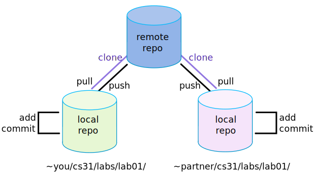
다음 사진에서 중요한것은 local, remote 이 두 글자이다.
local은 여러분의 컴퓨터에 있는 데이터를 의미하고 remote는 git 서버에 있는 데이터를 의미한다. 따라서, 우리는 local에 있는 데이터를 서버에 계속 push명령어로 올리면서 드라이브 처럼 사용할 수 있다는 것이다. 협업시에는 팀원이 서버에 올린 데이터를 pull명령어로 가져올 수 있다.

#


다음 그림을 보면 이게 뭔가 싶다. 그래서 바로 실습이 들어간 다음 이 그림을 다시보면 이해가 될것이다.

#### 3. Git, GitHub를 사용해보자

우선 Git을 설치하고 GitHub에 회원가입을 해놓자
그리고 GitHub Desktop을 사용하는것은 별로 추천하지 않는다. 오류가 많이 있었던걸로 기억한다.

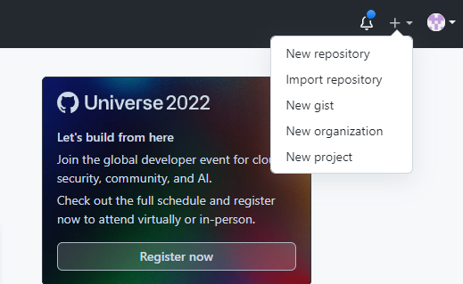
GitHub 오른쪽 위에 가면 + 버튼을 누르면 New repository가 나올것이다.

#

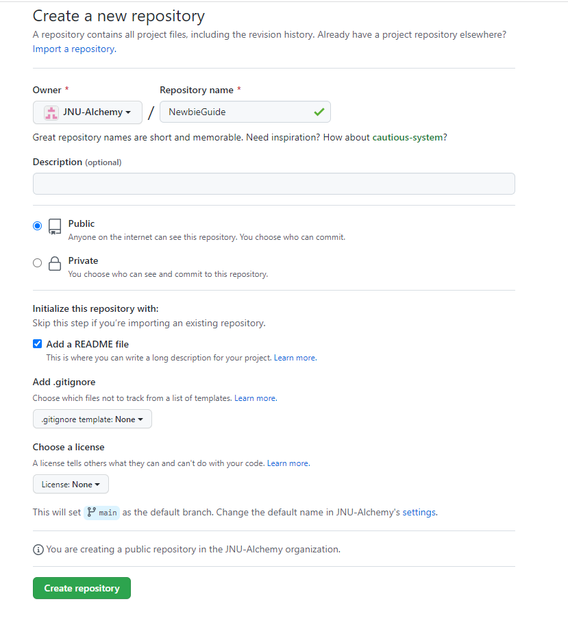
먼저 repository 이름을 작성하고
Public, Private을 설정할 수 있는데 이는 누구든 너의 코드를 볼수있냐를 선택하는것이다.
다음 Add a README file 체크가 되어있을텐데 이는 처음 repository에 README.md가 추가되느냐에 대한 내용이다.
.gitignore와 license에 해당하는 부분은 당장 필요한 내용이 아니니 생략하겠다.
Create repository 버튼 위에 보면 This will set main as ~~ 나와있을텐데 이는 default 브랜치가 main으로 설정된다는 안내이다. setting에 들어가서 이 브랜치 이름을 master 등으로 바꿀 수 있다. (보통 master로 한다.)

#

##### 3-1 브랜치란 무엇인가?

브랜치에 대해서 짚어보고 가자
아까 알아본 깃의 기능중 핵심인 버전관리의 주 기능이 branch 이다.
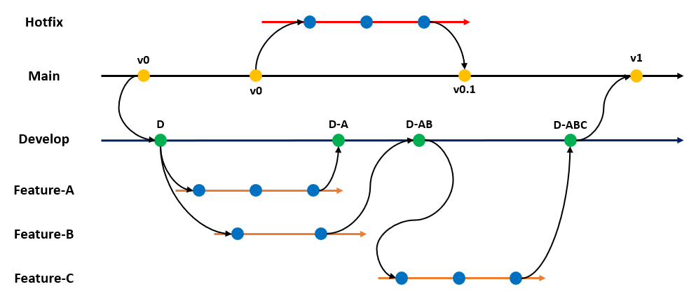
사진과 같이 개발을 하면서 기능을 추가하고자 하면 branch를 추가하여 개발을 진행한후 이상이 없을시 기능을 다시 원래 브랜치에 merge 한다. 이 모습이 나뭇가지를 닮았다고 하여? branch라고 불리는것 같다. git을 사용할 때, 이 브랜치라는게 눈에 잘 안익어서 힘든 사람을 위해 https://www.sourcetreeapp.com/ 소스트리라는 gui 프로그램이 존재한다.

#

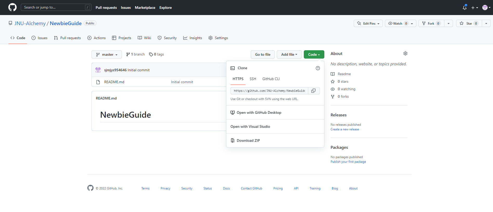
그렇게 repository를 생성하면 다음과 같은 모습이 나올것이다. README.md를 체크하면 다음과같이 나오는데 체크 하지않으면 아래와 같이 나올 것이다.

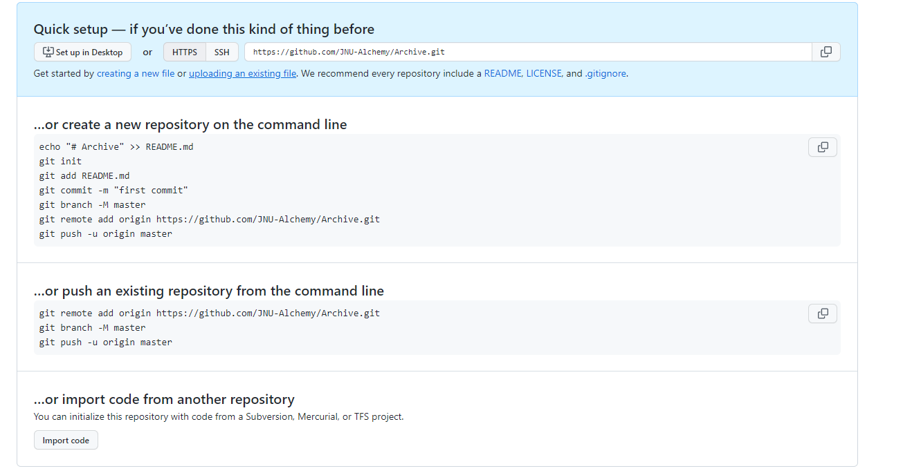

#

repository를 설정하는데 있어서 두가지 방법이 있는데

1. 새로운 폴더를 repository로 임명하고 이를 서버에 올린다.
2. 만들어진 repository를 clone해와서 이를 서버에 올린다.

#

##### 3-2 1번 방법

git을 처음 설치한다면 로그인 설정을 해줘야 될것이다. 이는 검색을 통해 해결하도록 하자 "git 초기 설정" 등의 키워드를 사용하자.

#

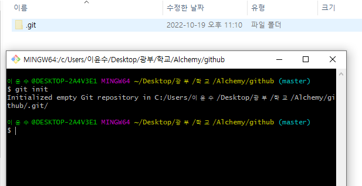
우선 본인이 repository로 만들 폴더를 만들고 우클릭을 한뒤 git bash를 열어보자

만약 git bash Here라는게 안뜰경우 아마 PATH를 설정안해줬거나 레지스트리 등의 문제일 것이다. google에 검색해서 해결하자

#

```git
git init
```

이라고 치면 숨겨진 .git 폴더가 생성될 것이다.

#

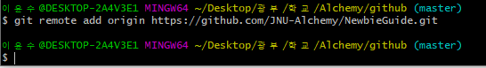

```git
git remote add origin 개인repository주소
```

개인repository주소 부분에는 아까 사이트에 HTTPS부분에 있는 주소를 넣으면된다.
Shell 이기 때문에 복사는 ctrl+insert 붙여넣기는 shift+insert 또는 우클릭으로 된다.
이 명령어는 origin이라는 이름의 원격 주소에 repository주소를 넣을거다 라고 이해하면 된다.

이후에 설정한 폴더에 아무 파일이나 만들어보자 ex) test.txt

#

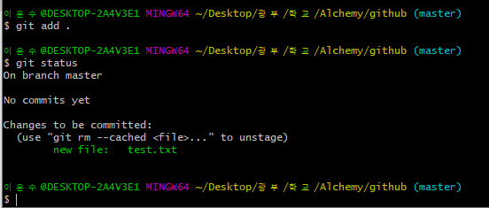

```git
git add .
git status
```

git add는 현재 내가 작업한 데이터 모두(.) stage에 올리겠다. 라는 뜻이다.
git status는 현재 stage에 올라간 파일이 무엇이 있는지 확인하는 코드이다.
제거된 파일이나 변경된 파일은 빨간색
추가된 파일은 초록색으로 표시된다.

#

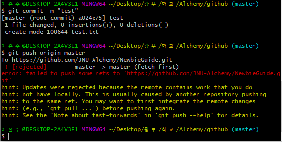

```git
git commit -m "test"
git push origin master(브랜치이름)
```

git commit은 stage에 있는 파일들을 local(내 컴퓨터)에 저장하겠다는 것이다. 뒤에 -m은 message를 의미하며 보통 변경 내역등을 작성한다. 그리고 -m을 작성하지 않으면 vi(쉘편집기)으로 들어가지게 되며 이에 대해서 알아보고 싶은경우 vi명령어에 대해서 공부해보자

#

git push 는 local에 있는 데이터를 서버로 보내는 것이다. master에는 현재 자신의 브랜치가 들어가야된다. 결과를 보면 오류가 떠있을 것이다.

#

이는 우리가 생성했던 README.md파일 때문이다. 서버에는 README.md 파일이 존재하는데, local에는 README.md파일이 존재했던 로그가 없기 때문이다.
검색을 통해 해결책을 찾아보자
error에 해당하는 부분을 구글에 넣으면 다른 사람들이 시도해본 내용들이나온다.
https://gdtbgl93.tistory.com/63

```
git pull origin master --allow-unrelated-histories
```

이를 입력하여 서버에 있는 데이터를 가져올 것이다.

#

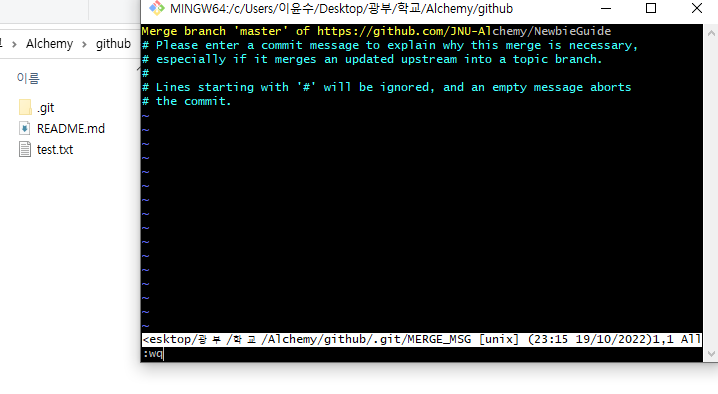
성공적으로 가져온다면 다음과 같이 merge하는 부분이 나올것이다
vi명령어중 :wq 를 입력(저장 종료)
그러면 성공적으로 폴더에 README.md 파일이 가져와졌다.

#

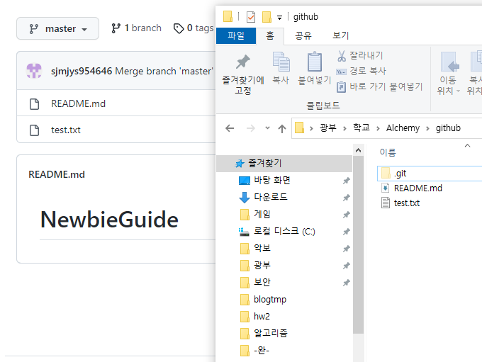

```git
git push origin master(브랜치이름)
```

다시 다음을 실행하면 github에서 test.txt가 올라간 모습을 확인 할 수 있다.

#

##### 3-3 2번 방법

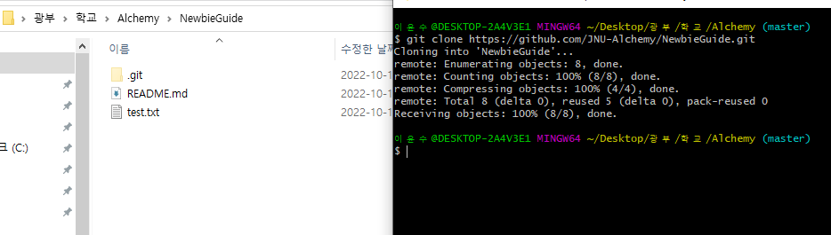

```git
git clone 개인repository주소
```

이는 다른사람또는 자신의 repository를 복사해서 가져오기 위한 명령어이다.
확인해보면 서버에 있는 내용 그대로 온 것을 볼 수 있다.

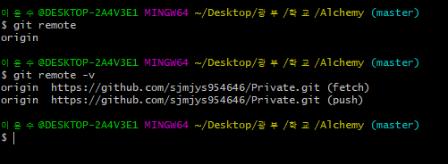
origin에 서버의 주소도 이미 할당되어 있는 모습을 볼 수 있다.
push, pull에 관련된 내용은 동일하다.

#### 4. 마무리

현재 적혀있는 내용은 git의 아주 일부 기능만 적혀있다. git의 진가는 협업을 할때 서로의 작업내용을 push, pull 하면서 conflict(충돌)이 났을때 이를 merge하며 수정해 나갈때 나온다. 개인이 작성한 코드를 저장할 때 필요한 명령어는 위에 있는 내용들로 충분 할 것이다.
